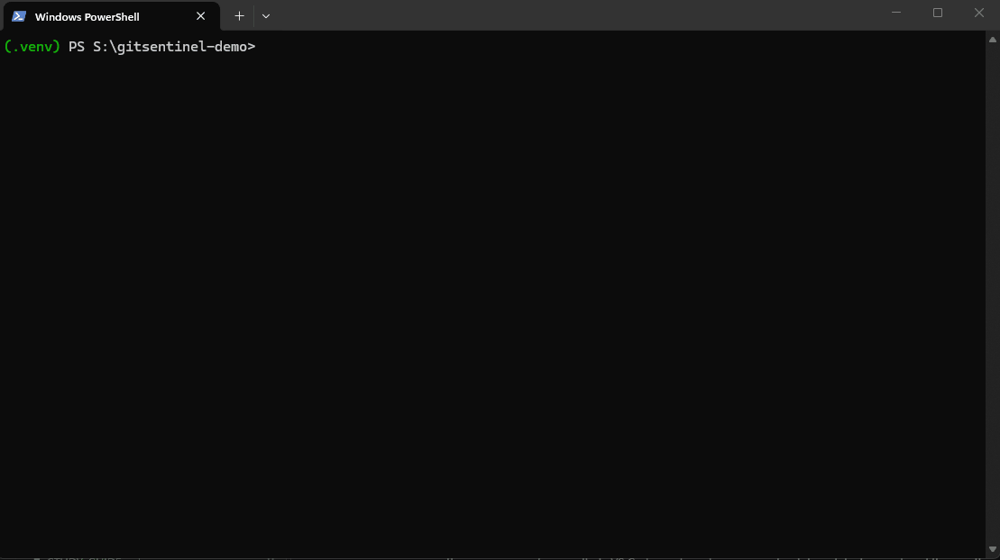

# GitSentinel

A local-first AI code auditor. It reads your `git diff`, understands the code
structurally (not just as text), and uses Claude to find real issues in your
changes — with retrieval over the rest of your codebase and, on request,
verification of its own suggested fixes.



## What it does

```
gs                # interactive menu
gs diff           # per-file diff stats
gs diff --json    # same data as JSON
gs review         # plain-English summary of the diff (Claude)
gs index          # build a local semantic index of the repo (Voyage embeddings)
gs findings       # structured findings: severity, category, file, line, message
gs findings --verify   # + apply each suggested fix to a scratch copy and run the test suite
```

## How it works

1. **Diff parsing** (`diff.py`) — a hand-rolled unified-diff state machine, not a
   library. It tracks file and hunk boundaries and captures real hunk content
   (not just `+`/`-` counts), plus file status (added/modified/deleted/renamed).
2. **Structural context** (`treesitter.py`, `context.py`) — for each hunk, finds
   the actual enclosing function/class via a Tree-sitter query (not manual
   tree-walking), falling back to a naive line window for non-Python files or
   hunks outside any function.
3. **Local RAG** (`rag.py`) — `gs index` chunks every Python file along
   Tree-sitter symbol boundaries, embeds each chunk with Voyage's
   `voyage-code-4` (a code-specific embedding model), and stores the vectors
   in a local SQLite file (`.gitsentinel/index.db`). At review time, each
   hunk's context is used to retrieve semantically related code elsewhere in
   the repo — chosen over ChromaDB for a smaller dependency footprint and
   inspectable storage for a single-repo-scoped tool.
4. **Structured findings** (`llm.py`) — findings are extracted via forced
   tool-use (not prompted "please respond in JSON"), guaranteeing a parseable
   shape, then independently validated with Pydantic before being trusted.
5. **Verification** (`verify.py`) — `--verify` applies each finding's exact
   `old_code` → `new_code` fix to a temporary scratch copy of the repo (never
   the real working tree) and runs the test suite against it, so a finding is
   only marked verified if the fix actually keeps tests passing.

## Setup

```
pip install -e .
```

Copy `.env.example` to `.env` and fill in:

```
ANTHROPIC_API_KEY=your-key-here
VOYAGE_API_KEY=your-key-here
```

Then, from inside a git repo:

```
gs index      # optional, but required for related_code in gs findings
gs findings
```

## Evals

`evals/` measures the reviewer's actual quality against 7 hand-planted
fixtures: a logic bug (off-by-one), a null-dereference bug, two security
issues (hardcoded secret, SQL injection), a style-only nit, and two genuinely
clean diffs that should produce zero findings. Scoring is line-based, not
exact-text-match — a planted issue is "caught" if any finding lands within 2
lines of it, since the model's wording varies run to run. Model responses
are cached by diff content hash so re-running while refactoring costs
nothing; `--refresh` forces a real call.

```
python evals/runner.py            # cached
python evals/runner.py --refresh  # fresh API calls
```

**Current results** (Claude Haiku, `voyage-code-4`, single run, no cherry-picking):

| Metric | Result |
|---|---|
| Catch rate | 100% (5/5 planted issues found) |
| False positives | 1 finding across 2 clean fixtures |
| Category accuracy | 60% (of caught findings) |
| Severity accuracy | 80% (of caught findings) |

Two honest notes from the actual run, not smoothed over:
- The one false positive flagged `if b == 0:` (comparing a float to `0`) as a
  low-severity floating-point-comparison nit on an otherwise-clean
  divide-by-zero guard — a defensible-but-overzealous nitpick, not a
  hallucinated bug.
- Category accuracy is lower than severity accuracy because `category` is
  free text in the tool schema (unlike `severity`, which is a constrained
  enum) — the model called an off-by-one bug `"logic_error"` where the
  fixture expected `"bug"`, which a loose substring match doesn't catch. That's
  a real scoring-methodology limitation surfaced by actually running this,
  not a reviewer failure.

## Why these choices

- **Claude Haiku**, not Opus — diff summarization and findings extraction are
  cheap, low-reasoning tasks; the fast/cheap tier is the right fit.
- **A hand-rolled diff parser**, not `unidiff`/`whatthepatch` — writing the
  actual unified-diff state machine is the point.
- **SQLite**, not ChromaDB, for the local index — smaller footprint, and the
  storage is just a normal `.db` file you can inspect with any SQLite client.
- **Tree-sitter**, not regex or manual parsing, for structural context — real
  AST-based analysis, scoped to Python for now.
